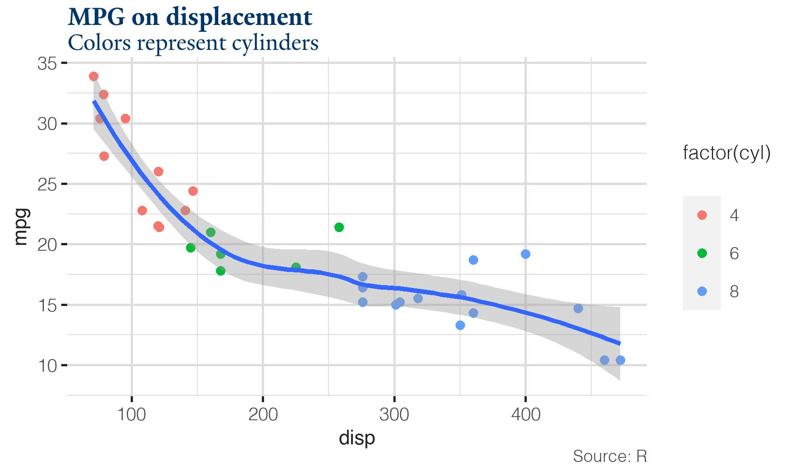
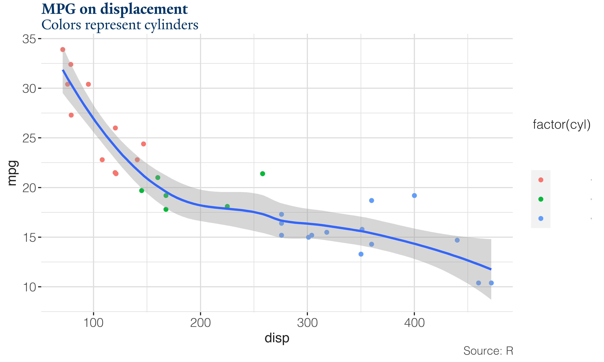

# theme

This repository is an evolving project to standardize the production of figures within R, an open-source statistical package. Researchers who publish with[in] the Yale School of Management will recognize its distinct use of Helvetica Neue, while affiliated with the University at large will recognize its [typekit](https://yaleidentity.yale.edu/web) and [palette](https://toolness.github.io/accessible-color-matrix/?n=white&n=light&n=emphasis&n=Yale%20blue&n=black&v=F9F9F9&v=63AAFF&v=286DC0&v=00356B&v=222222) of blues. However, conforming to the school's style can be a time-consuming process, likely to be ignored in favor of other work. A standard theme can plug the gap caused by tedious formatting.

## How to use
This repo leverages two packages: [`ggplot2`](https://ggplot2.tidyverse.org/), which produces figures; and [`showtext`](https://github.com/yixuan/showtext), which facilitates the usage of OpenType, TrueType, and Type1 fonts.
```
library(ggplot2)
library(showtext)
```

Before calling any of the themes in this repo, you must enable `showtext` to comandeer RStudio's graphics backend.
Otherwise, calling the library does nothing for the final product.
Additionally, you must install the fonts to the R session.
If, like me, you rarely save workspace images, you will have to re-install each R session you launch.
```
showtext_auto()
font_add("Yale", "fonts/YaleNew-Roman.otf", "fonts/YaleNew-Bold.otf", "fonts/YaleNew-Italic.otf", "fonts/YaleNew-BoldItalic.otf")
font_add("Helvetica", "fonts/Helvetica-Light.ttf", "fonts/Helvetica.ttf", "fonts/Helvetica-Oblique.ttf", "fonts/Helvetica-BoldOblique.ttf")
```
The Helvetica included here is a [lookalike](https://www.dafontfree.io/helvetica-neue-font-free/) of the Neue Light face.
YaleNew is [approved](https://yaleidentity.yale.edu/typefaces) for use only by students and staff, so it is not included it in `fonts/`.
`showtext` inadvertantly aids Yale's licensing agreement by converting typefaces to polygons (normally, PDFs embed typefaces in the documents).

Now, simply call the theme as you would any other!

## Variants
Currently, this repository only supports the Yale SOM style. We would love to support more themes! If you are affiliated with another Yale school/discipline/publication that has (or would like to develop) its own style, please reach out.

Unfortunately, producing igures for publication is not as seamless as `ggplot2`.
Specifically, resizing figures to meet the quality expectations of publications will often shrink fonts to a point of unusability.
To keep matters simple, we present three pre-sized variants: web (small); web (big); and print.
Here's how the three compare when using one of R's built-in datasets.

### web (small)
This variant is appropriate for web figures between 8 and 15cm wide and 5 to 10cm tall. Both this and the web publication variant assume a retina display of 350dpi and---when using lossy file formats---often produce file sizes below 500kb.
```
ggplot(mtcars, aes(disp, mpg)) +
  geom_point(aes(col = factor(cyl))) +
  geom_smooth() +
  labs(title = "MPG on engine displacement", subtitle = "Colors represent cylinders", caption = "Source: R") +
  theme_web_small()
```


### web (big)
This variant is appopriate for web figures between 20 and 36cm wide and 12 to 20cm tall.
```
ggplot(mtcars, aes(disp, mpg)) +
  geom_point(aes(col = factor(cyl))) +
  geom_smooth() +
  labs(title = "MPG on engine displacement", subtitle = "Colors represent cylinders", caption = "Source: R") +
  theme_web_big()
```


### print
This variant is appropriate for print publications, which often require PDFs.
It is also the "stock" SOM theme, with minimal tweaks to font sizing.
Using the export as PDF option in RStudio with the cairo device, this variant can produce a huge range of sizes without adjustment.
```
ggplot(mtcars, aes(disp, mpg)) +
  geom_point(aes(col = factor(cyl))) +
  geom_smooth() +
  labs(title = "MPG on engine displacement", subtitle = "Colors represent cylinders", caption = "Source: R") +
  theme_print()
```
The example image is located at [`theme_print.pdf`](examples/theme_print.pdf).

## Featured work
These blog posts show the themes in action.
* [Debt Mounts for US Retail and Lodging Mortgagors](https://som.yale.edu/blog/debt-mounts-for-us-retail-and-lodging-mortgagors)
* [Reserve liquidity facilities shift from advanced economies to emerging markets](https://som.yale.edu/blog/reserve-liquidity-facilities-shift-from-advanced-economies-to-emerging-markets) *code used to create this plot resides in [`dollar_index.R`](dollar_index.R)
* [Pandemic catalyzes transition to cashless benefits](https://som.yale.edu/blog/pandemic-catalyzes-transition-to-cashless-benefits)
* [Paycheck Protection Program spread loans widely, if not evenly](https://som.yale.edu/blog/paycheck-protection-program-spread-loans-widely-if-not-evenly)

## Next steps
* Unify SOM themes under single function that allows for easy manipulation of font and line sizes (sensible defaults)
* Integrate color palette values, a la [`ggthemes`](https://yutannihilation.github.io/allYourFigureAreBelongToUs/ggthemes/)
* Function to add recession bars
* Expand to Python & TeX
* Add other schools (Mallory font family [available](https://www.cufonfonts.com/font/mallory))